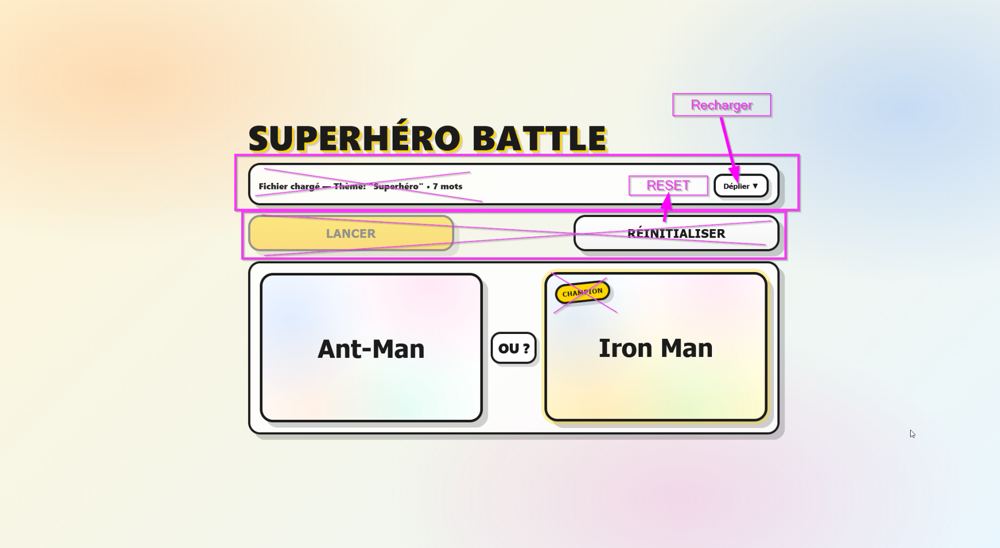
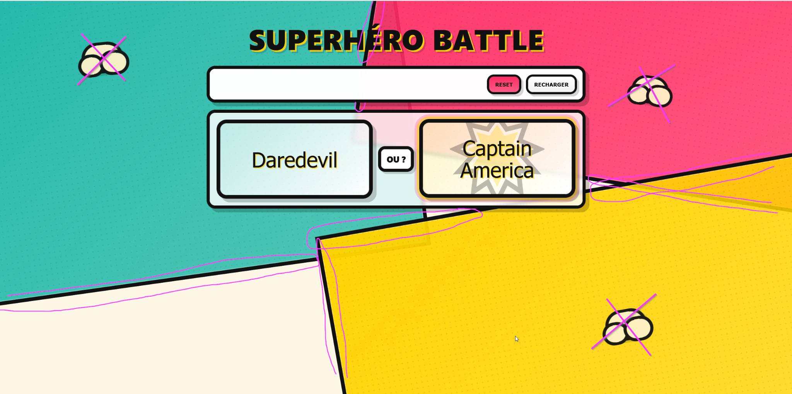
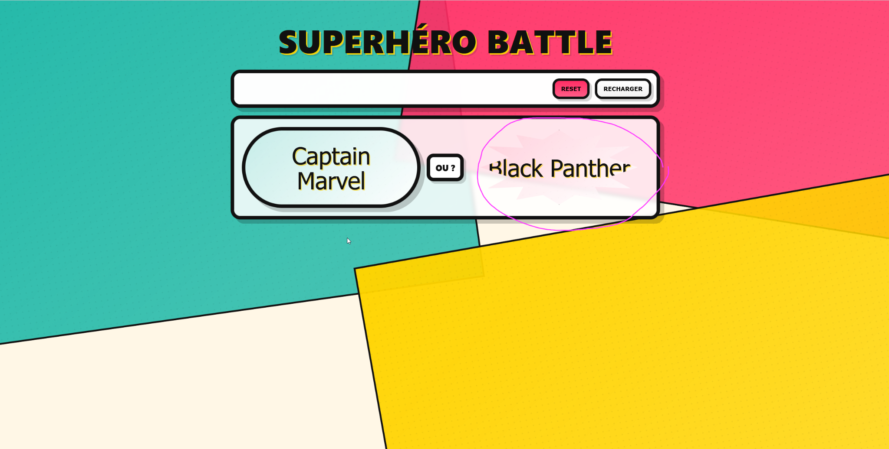
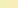
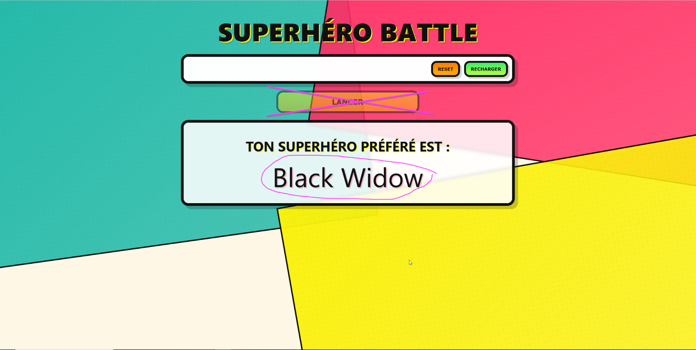

# Prompt initial

```
Hello, on va développer une nouvelle application simple dans un seul fichier .html qui contient html CSS et JS. 
L'application est comme ceci : 
- on peut charger un fichier qui contient une liste de mots : un mot ou expression par ligne. 
- le premier mot est le thème de la liste, il a un statut à part et ne fait pas partie de la liste de mots. Dans la suite de ce prompt on l'appellera <THEME>
- une fois qu'on a chargé le fichier, la zone de chargement se minimise, il y a quand même possibilité de la déplier pour charger un autre fichier par la suite 
- en dessous de la zone de chargement il y a un gros bouton "Lancer". Quand on clique dessus, cela lance le jeu 
- Le jeu est en plusieurs tours, voici ce qu'il se passe à chaque tour :
- deux mots (hors <THEME> qui est à part) sont pris au hasard dans le fichier, ils sont affichés en gros et entre les mots c'est écrit "ou" ? Par exemple si les mots choisis sont "Iron Man" et "Hulk", ça écrit "Iron Man ou Hulk ?" Mais chaque mot est en fait un gros bouton cliquable 
- dès qu'un mot est affiché à l'écran il est enlevé de la liste de mots 
- Ensuite le joueur clique sur un des deux mots. Le mot sur lequel il a cliqué reste en place et l'autre mot est remplacé par un mot restant dans la liste, tiré au sort 
- Quand il n'y a plus de mot dans la liste, on écrit en gros "Ton <THEME> préféré est : <le dernier mot qui reste>" 
Peux-tu me coder cette application et applique-toi stp pour ce soir fonctionnel, jouable, très facile à utiliser et respecte bien mes spécifications
```

# Correction


```
OK c'est très bien mais je voudrais faire plusieurs améliorations : 
- Comme titre au lieu de "Choisis ton préféré" je voudrais le titre "<THEME> BATTLE" 
- Enlève l'instruction en dessous du titre. Les instructions doivent être présentes uniquement dans la zone de chargement 
- Enlève le résumé dans la zone de chargement 
- Enlève le titre et les infos dans la zone de jeu 
- Enlève le mode d'emploi dans la zone de jeu 
- Pour la zone de chargement fais quelque chose au plus simple, avec une zone de glisser déposer et un bouton "parcourir" dedans et les instructions dans la zone de glisser/déposer 
- Ensuite, à chaque tour, le mot qui a été choisi et qui reste doit être mis en surbrillance bien visible pour comprendre que c'est le champion du moment 
- Enfin, change le thème pour faire quelque chose sur fond clair et coloré style comics américain
```

# Correction




```
OK super, il faut faire d'autres améliorations, voici la liste : 
- on simplifie encore : une fois qu'on a chargé un fichier, la zone de chargement n'affiche presque rien. Seulement deux choses : 
- le bouton "Déplier" est bien mais il doit s'appeler "Recharger" à la place de "Déplier" et il déplie la zone de chargement 
- En plus du bouton "Déplier" il faut ajouter un bouton "Reset" qui réinitialise le jeu. 
- En dessous de la zone de chargement, il doit y avoir un bouton "Lancer" au milieu, au début du jeu mais une fois que le jeu est lancé alors le bouton "Lancer" disparaît 
- Pas besoin d'écrire "Champion" sur le champion, un effet type surbrillance bien marquée est suffisant 
- concernant le style, cela ne convient pas. je t'envoie en pièce jointe une image de style comic book américain dont tu dois t'inspirer en terme de couleurs et de style de toute l'application. Refais un style similaire à cette image en terme de textes, de traits, d'effets autour des mots. Pour faire des motifs tu peux faire du dessin vectoriel SVG en copiant sur l'image que je t'ai envoyée
```

# Correction



```
OK on continue les améliorations de style : 
- enlève les 3 formes bizarres parsemées dans l'image (je les ai rayées dans la capture d'écran) 
- En dehors des zones de chargement, jeu et des boutons, fais les traits noirs beaucoup plus fins (je les ai entourés en rose) 
- Pour la zone de chargement : simplifie le style : pas besoin de couleur spéciale sur les mots. Ce sont des explications, cela doit être très lisible. De même pour le truc en pointillé autour, fais quelque chose de plus conventionnel en terme de style. Cette zone de chargement doit être plus classique car ce sont les règles et c'est affiché qu'au début 
- Enfin, pour les gros boutons, nouvelle idée : au lieu de la surbrillance, le bouton se transforme en sorte de "bulle-étoile" comme tu as fait apparaitre en fond quand on passe dessus. Le champion reste toujours en forme de bulle-étoile et le challenger doit être une forme ovale allongée. Quand on passe la souris sur le challenger ça transforme la forme ovale en bulle-étoile comme pour le champion, si on enlève la souris ça redevient ovale. Quand on passe la souris sur la bulle-étoile de champion alors ça remet une couche de surbrillance en plus autour
```

# Correction







```
OK c'est bien on se rapproche du but mais il faut encore quelques modifications : 
- Pour les bulle-étoiles il faut un trait noir de délimitation des pics de l'étoile. Le fond doit être jaune du même jaune que le petit carré jaune que j'envoie en pièce jointe 
- Le texte doit être "au dessus" de la bulle-étoile, ce n'est pas grave si ça déborde sur les côtés 
- Pour l'ovale du challenger il doit avoir un fond de couleur jaune pâle comme la couleur du petit carré jaune pâle que je t'envoie en pièce jointe 
- Pour le bouton "Recharger", mets un fond de couleur vers clair pétant en harmonie avec les autres couleurs. 
- Pour le bouton "Reset" mets un fond orange pétant en harmonie avec les autres couleurs
```

# Correction



```
Encore quelques modifications :
- Le bouton "lancer" ne doit pas être visible à la fin. On ne doit le voir qu'au début. 
- Pour tous les mots de la liste (boutons de phase de jeu et affichage à la fin) est-ce que tu peux les mettre en police Comic Sans MS Bold ? 
- Pour les autres textes, garde la même police qu'on a déjà
```

# Notes
Code généré avec ChatGPT 5.2 le 21 janvier 2026