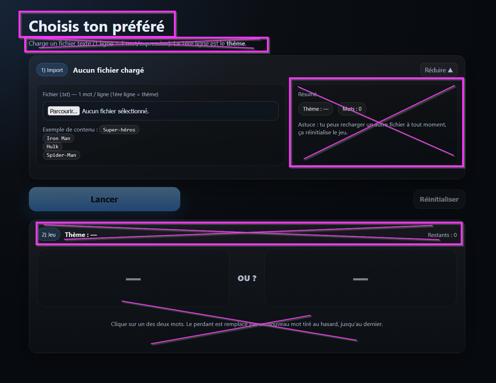
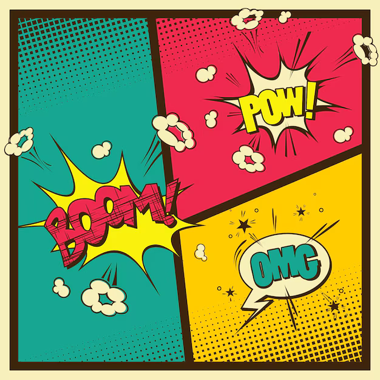

# Documentation des prompts IA

Ce dossier contient les prompts structurants utilisés pour générer, modifier ou faire évoluer ce projet avec l’aide d’une IA générative.

L’objectif n’est pas de conserver toute la conversation avec l’IA, mais de documenter les prompts importants qui ont servi de base à la conception, aux choix fonctionnels, aux évolutions majeures ou aux corrections significatives du projet.

## Pourquoi conserver les prompts ?

Dans ce projet, les prompts jouent un rôle proche d’une spécification fonctionnelle ou technique.

Ils permettent de comprendre :

- l’intention initiale du projet ;
- les fonctionnalités demandées ;
- les contraintes données à l’IA ;
- les images ou références visuelles utilisées ;
- les choix de conception faits au fil du temps ;
- l’évolution du projet au-delà du simple historique Git.

Le code montre **ce qui a été fait**.  
Les prompts aident à comprendre **pourquoi et comment cela a été demandé**.

## Organisation du dossier

Les prompts sont classés par ordre chronologique.

Exemple :

```text
docs/ai-prompts/
  README.md
  01-initial-generation.md
  02-add-comments-feature.md
  03-ui-improvements.md
  images/
    01-image-prompt.png
    02-ui-reference.png
```

## Convention de nommage

Chaque fichier de prompt suit cette forme :

```text
NN-description-courte.md
```

Exemples :

```text
01-initial-generation.md
02-add-comments-feature.md
03-fix-mobile-layout.md
04-improve-readme.md
```

Le numéro permet de garder l’ordre chronologique des prompts dans l’historique du projet.

## Structure recommandée d’un fichier de prompt

Chaque fichier de prompt reste volontairement simple.

Il contient principalement :

- le prompt initial ;
- les prompts de correction ou d’amélioration, dans l’ordre chronologique ;
- les images utilisées comme références, placées au bon endroit dans l’historique ;
- éventuellement une section de notes à la fin.

L’objectif n’est pas de produire une documentation lourde, mais de conserver une trace claire des demandes importantes faites à l’IA.

Exemple de structure :

````md
# Prompt initial

```text
Prompt initial envoyé à l’IA.
```

# Correction



```text
Prompt de correction ou d’amélioration envoyé à l’IA.
```

# Correction



```text
Autre prompt de correction ou d’amélioration.
```

# Notes

Notes complémentaires, contexte, limites connues ou informations utiles pour comprendre l’historique du projet.
````

Les images peuvent être insérées directement avant le prompt auquel elles se rapportent, afin de garder le lien entre la demande faite à l’IA et les références visuelles utilisées.


## Images utilisées dans les prompts

Les images utilisées comme références sont stockées dans le dossier :

```text
docs/ai-prompts/images/
```

Pour afficher une image dans un fichier Markdown :

```md

```

Exemple :

```md

```

## Ce qui doit être conservé

Sont conservés dans ce dossier :

- les prompts de génération initiale ;
- les prompts ajoutant une fonctionnalité importante ;
- les prompts modifiant fortement l’interface ou l’architecture ;
- les prompts corrigeant un problème significatif ;
- les prompts contenant des décisions produit ou techniques ;
- les images de référence utilisées dans les prompts.

## Ce qui ne doit pas être conservé

Ne sont pas conservés ici :

- les échanges mineurs avec l’IA ;
- les essais sans impact sur le projet ;
- les conversations trop longues non nettoyées ;
- les informations personnelles ;
- les secrets, tokens, mots de passe ou clés API ;
- les données confidentielles.

## Philosophie

Cette documentation considère les prompts comme une partie importante de l’historique du projet.

Ils ne remplacent pas le code, les commits ou la documentation classique, mais ils complètent l’ensemble en conservant la trace des intentions exprimées lors du développement assisté par IA.